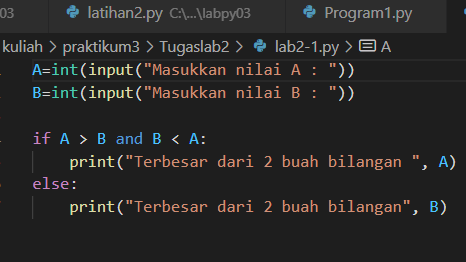
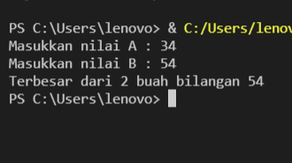
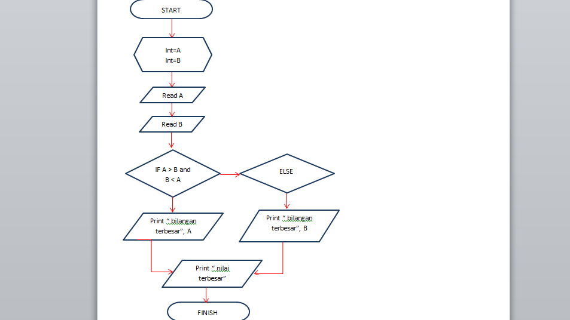
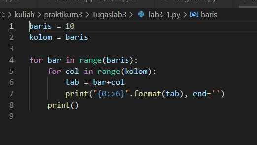
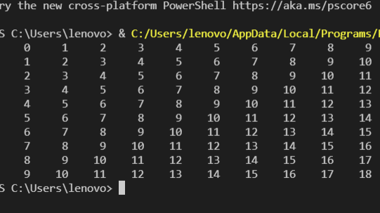

# TUGAS LAB 2 
## LAB 2 - 1 
### Program sederhada dengan input 2 buah bilangan, kemudian tentukan bilangan terbesar dari kedua bilangan.

berikut ini adalah tampilan programnya 

berikut adalah saat program runnning 

berikut adalah flowchart dari program tersebut

## LAB 2 - 2
### program untuk mengurutkan data berdasarkan input sejumlahdata (minimal 3 variable input atau lebih),kemudian tampilkan hasilnya secara berurutan mulai dari data terkecil.

ini adalah tampilan dari programn tersebut 

![gambar]

# TUGAS LAB 3
## Lab 3 - 1
### Buat program dengan perulangan bertingkat (nested) for.
berikut ini adalah programnya 

berikut adalah saat program running

penjelasan:

- Variabel Pendeklarasian

baris = 10

kolom = baris 

- untuk perulangan baris dan kolom menggunakan nested for 

for bar in range(baris):

    for col in range(kolom):

        tab = bar+col

- untuk menampilkan hasil dari perulangan 

1.agar terlihat rapi menggunakan format string rata ke kanan sebanyak 6 karakter

2.agar tidak membuat baris baru mengunakan end=''(baris)

3.penggunaan print () untuk membuat baris baru kolom 

print("{0:>6}".format(tab), end='')

    print()

