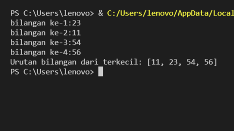
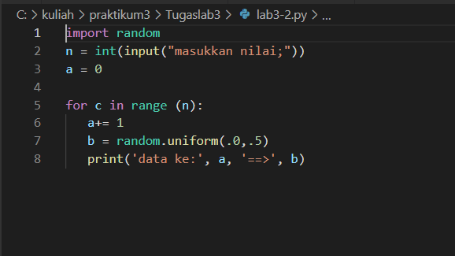
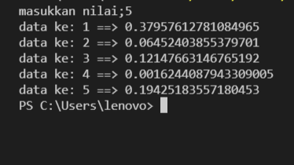
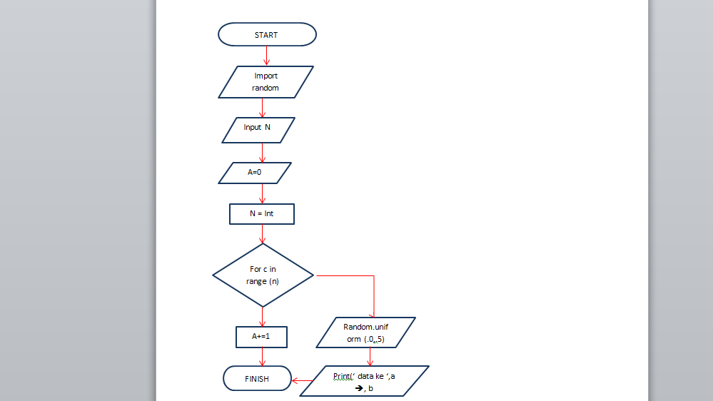

# TUGAS LAB 2 
## LAB 2 - 1 
### Program sederhada dengan input 2 buah bilangan, kemudian tentukan bilangan terbesar dari kedua bilangan.

berikut ini adalah tampilan programnya 

berikut adalah saat program runnning 

berikut adalah flowchart dari program tersebut

pseudocode:

- A dan B sebagai variabel int dari inputan

- masukkan nilai dari A dan B 

- program akan membaca apakah A > B dan B > A 
- sistem akan menampilkan nilai terbesar dari antara variabel A atau B jika A > B atau B > A
 

penjelasan:

- variabel pendeklerasiaan untuk sistem penginputan saat running 

A=int(input("Masukkan nilai A : "))

B=int(input("Masukkan nilai B : "))

- untuk mencari bilangan terbesar dari 2 bilangan algoritmanya yang dimasukkan akan membandingkan terlebih dahulu apakah A > B dan B < A

- jika A > B maka sistem akan menampilkan nilai dari A 

- tetapi jika nilai B > A maka sistem akan menampilkan nilai dari B 

## LAB 2 - 2
### program untuk mengurutkan data berdasarkan input sejumlah data (minimal 3 variable input atau lebih),kemudian tampilkan hasilnya secara berurutan mulai dari data terkecil.

berikut ini adalah tampilan dari programnya 

berikut ini adalah tampilan dari programnya

penjelasan :

- A,B,C,D sebagai variabel dari sebuah inputan 
- untuk memasukkan nilai dari sebuah inputan kita menggunakan int dan input contoh :

A=int(input("bilangan ke-1:"))

B=int(input("bilangan ke-2:"))

C=int(input("bilangan ke-3:"))

D=int(input("bilangan ke-4:"))

- masukkan nilai dari A,B,C,D 

- luas = [ A, B, C, D,] adalah sebuah perintah bahwa pemisah dari hasil inputan adalah koma  
- untuk membuat agar hasil dari inputan berurutan mulai dari data terkecil menggunakan sorted

# TUGAS LAB 3
## Lab 3 - 1
### Buat program dengan perulangan bertingkat (nested) for.
berikut ini adalah programnya 

berikut adalah saat program running

penjelasan:

- Variabel Pendeklarasian

baris = 10

kolom = baris 

- untuk perulangan baris dan kolom menggunakan nested for 

for bar in range(baris):

    for col in range(kolom):

        tab = bar+col

- untuk menampilkan hasil dari perulangan 

1.agar terlihat rapi menggunakan format string rata ke kanan sebanyak 6 karakter

2.agar tidak membuat baris baru mengunakan end=''(baris)

3.penggunaan print () untuk membuat baris baru kolom 

print("{0:>6}".format(tab), end='')

    print()

## Lab 3 - 2
### Tampilkan n bilangan acak yang lebih kecil dari 0.5.
### nilai n diisi pada saat runtime
### anda bisa menggunakan kombinasi while dan for untuk menyelesaikannya

berikut ini adalah programnya

berikut ini adalah program saat running

berikut ini flowchart dari program tersebut

penjelasan

- menggunakan  modul import random untuk membuat bilangan acak

- Untuk menentukan jumlah input yang diinginkan dan konversi ke dalam bilangan bulat (integer) yang dimasukan ke variabel(n), n = int(input("masukkan nilai;"))

- untuk membuat urutan dari inputan tersebut mengunakan a=0 ,a+=1 yang menandakan urutan tersebut dimulai dari 1 dan ditambah 1 

- untuk membuat rentang retret yang diinputkan oleh variabel (n) ,for c in range (n): 

- Untuk menampilkan urutan data sesuai jumlah inputan dengan hasil di bawah 0.5

    a+= 1

   b = random.uniform(.0,.5)

   print('data ke:', a, '==>', b)

