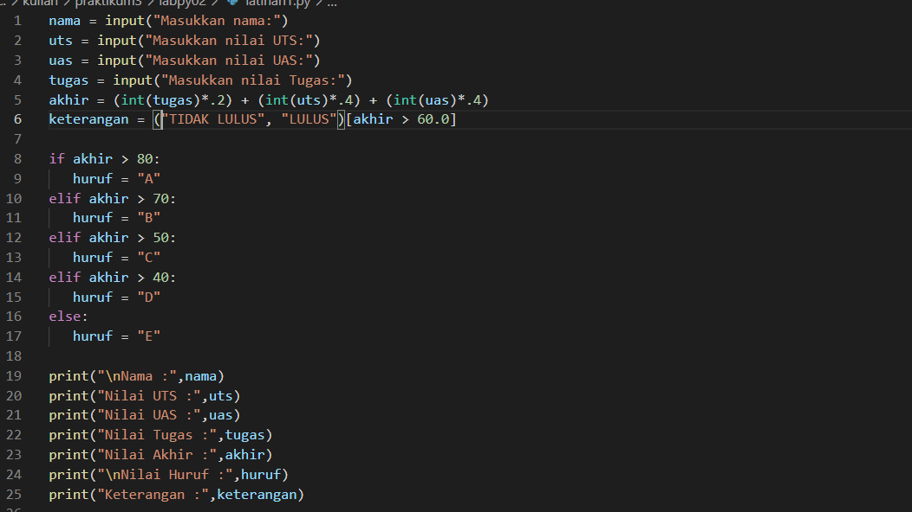
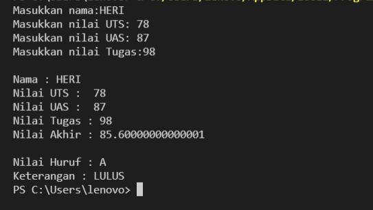
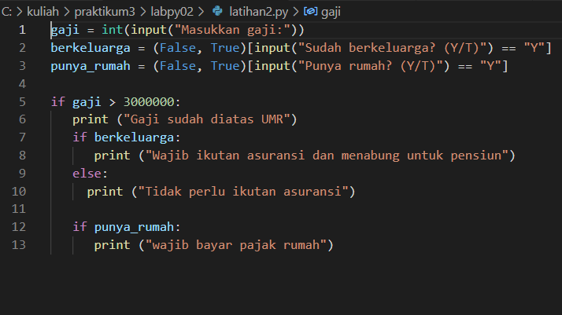
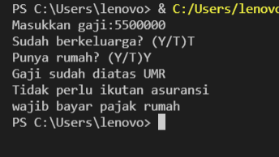
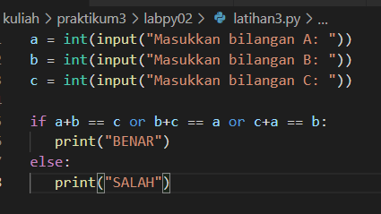
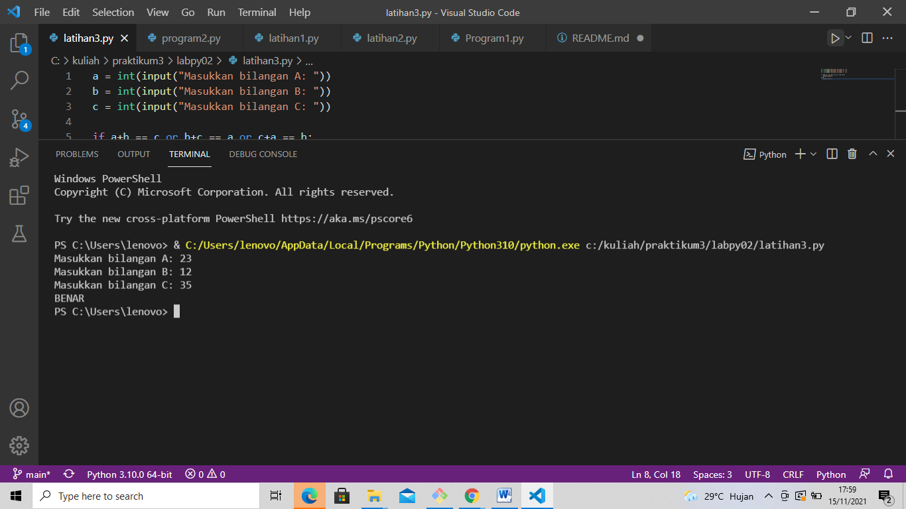
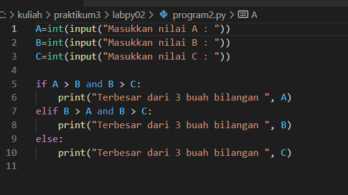
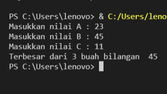
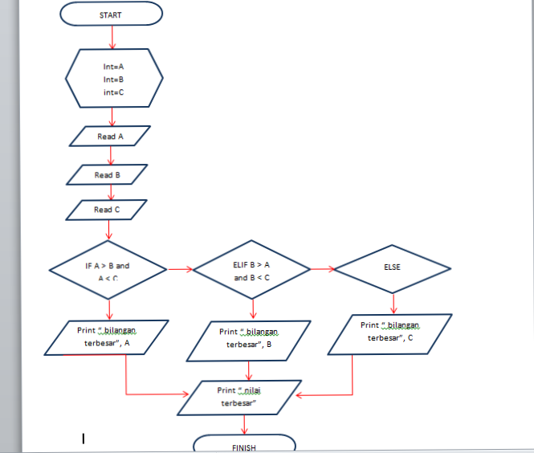

# TUGAS LAB 2 
## LAB 2 - 1 
### Program sederhada dengan input 2 buah bilangan, kemudian tentukan bilangan terbesar dari kedua bilangan.

berikut ini adalah tampilan programnya 

berikut adalah saat program runnning 

berikut adalah flowchart dari program tersebut

pseudocode:

- A dan B sebagai variabel int dari inputan

- masukkan nilai dari A dan B 

- program akan membaca apakah A > B dan B > A 

- sistem akan menampilkan nilai terbesar dari antara variabel A atau B jika A > B atau B > A
 

penjelasan:

- variabel pendeklerasiaan untuk sistem penginputan saat running 

A=int(input("Masukkan nilai A : "))

B=int(input("Masukkan nilai B : "))

- untuk mencari bilangan terbesar dari 2 bilangan algoritmanya yang dimasukkan akan membandingkan terlebih dahulu apakah A > B dan B < A

- jika A > B maka sistem akan menampilkan nilai dari A 

- tetapi jika nilai B > A maka sistem akan menampilkan nilai dari B 

## LAB 2 - 2
### program untuk mengurutkan data berdasarkan input sejumlah data (minimal 3 variable input atau lebih),kemudian tampilkan hasilnya secara berurutan mulai dari data terkecil.

berikut ini adalah tampilan dari programnya 

berikut ini adalah tampilan dari programnya

penjelasan :

- A,B,C,D sebagai variabel dari sebuah inputan 
- untuk memasukkan nilai dari sebuah inputan kita menggunakan int dan input contoh :

A=int(input("bilangan ke-1:"))

B=int(input("bilangan ke-2:"))

C=int(input("bilangan ke-3:"))

D=int(input("bilangan ke-4:"))

- masukkan nilai dari A,B,C,D 

- luas = [ A, B, C, D,] adalah sebuah perintah bahwa pemisah dari hasil inputan adalah koma  
- untuk membuat agar hasil dari inputan berurutan mulai dari data terkecil menggunakan sorted

# TUGAS LAB 3
## Lab 3 - 1
### Buat program dengan perulangan bertingkat (nested) for.
berikut ini adalah programnya 

berikut adalah saat program running

penjelasan:

- Variabel Pendeklarasian

baris = 10

kolom = baris 

- untuk perulangan baris dan kolom menggunakan nested for 

for bar in range(baris):

    for col in range(kolom):

        tab = bar+col

- untuk menampilkan hasil dari perulangan 

1.agar terlihat rapi menggunakan format string rata ke kanan sebanyak 6 karakter

2.agar tidak membuat baris baru mengunakan end=''(baris)

3.penggunaan print () untuk membuat baris baru kolom 

print("{0:>6}".format(tab), end='')

    print()

## Lab 3 - 2
### Tampilkan n bilangan acak yang lebih kecil dari 0.5.
### nilai n diisi pada saat runtime
### anda bisa menggunakan kombinasi while dan for untuk menyelesaikannya

berikut ini adalah programnya

berikut ini adalah program saat running

berikut ini flowchart dari program tersebut

penjelasan

- menggunakan  modul import random untuk membuat bilangan acak

- Untuk menentukan jumlah input yang diinginkan dan konversi ke dalam bilangan bulat (integer) yang dimasukan ke variabel(n), n = int(input("masukkan nilai;"))

- untuk membuat urutan dari inputan tersebut mengunakan a=0 ,a+=1 yang menandakan urutan tersebut dimulai dari 1 dan ditambah 1 

- untuk membuat rentang retret yang diinputkan oleh variabel (n) ,for c in range (n): 

- Untuk menampilkan urutan data sesuai jumlah inputan dengan hasil di bawah 0.5

    a+= 1

   b = random.uniform(.0,.5)

   print('data ke:', a, '==>', b)

# LABPY02
## LATIHAN 1 
### Membuat program menentukan nilai akhir

berikut ini adalah programnya 

berikut ini adalah program saat running

penjelasan :

- program ini adalah untuk menentukan nilai akhir dari mahasiswa dengan sistem perhitungan nilai akhir dengan sistem akhir=(int(tugas) * .2) + (int(uts) * .4) + (int(uas) * .4)

- dan akan menampilkan lulus atau tidak lulus dengan sistem,  keterangan = ("TIDAK LULUS", "LULUS")[akhir > 60.0] 

- sistem dari sebuah perhitungan ialah menggunakan nilai dari UTS,UAS dan TUGAS yang sudah diinputkan dan jika nilai tersebut diatas dari perhitungan  nilai akhir mahasiswa akan dinyatakan LULUS tetapi jika tidak maka mahasiswa dinyatakan TIDAK LULUS 

 
## LATIHAN 2
### Membuat program menampilkan status gaji karyawan.

berikut ini adalah programnya

berikut ini adalah program saat running 

penjelasan :

- masukkan nilai inputan dari gaji 

- masukkan inputan apakah sudah berkeluarga dengan mengisi (Y/T) proses ini menggunakan sistem . berkeluarga = (False, True)[input("Sudah berkeluarga? (Y/T)") == "Y"]

- masukkan inputtan apakah sudah memiliki rumah dengan mengisi (Y/T) proses ini menggunakan sistem .punya_rumah = (False, True)[input("Punya rumah? (Y/T)") == "Y"]

## LATIHAN 3
### penggunaan kondisi OR program membandingkan 3 input bilangan, apabila penjumlahan 2 bilangan hasilnya sama dengan bilangan lainnya, maka cetak pernyataan “BENAR”

berikut ini adalah programnya 

berikut ini adalah program saat running 

penjelasan 

- variabel deklarasi menggunakan A,B,C 
- untuk dapat memasukkan nilai dari inputan menggunakan int contoh
a = int(input("Masukkan bilangan A: "))

b = int(input("Masukkan bilangan B: "))

c = int(input("Masukkan bilangan C: "))

- program dari sistem penjumlahan yang digunakan yaitu if a+b == c or b+c == a or c+a == b:
- masukkan nilai inputan dari A dan B dan inputan C adalah hasil penjumlahan dari A dan B jika nilai inputan dari C tidak sesuai dengan penjumlahan A dan B maka sistem akan menampilkan tulisan SALAH tetapi jika nilai inputan C sesuai dengan hasil dari penjumlahan A dan B sistem akan menampilkan tulisan BENAR
 

## PROGRAM 2
### Buat repository dengan nama labspy02
### Buat program sederhana dengan input tiga buah bilangan, dari ketiga bilangan tersebut tampilkan bilangan terbesarnya. Gunakan statement if.
### Uraikan langkah atau algoritmanya pada file README.md, sertakan juga flowchart dan screenshot hasil eksekusi program. Tampilkan 3 kondisi inputan data.
### Commit dan push pada repository
### submit url repository pada classroom.

berikut ini adalah programnya 

berikut ini adalah program saat running 

berikut ini flowchart dari program tersebut

pseudocode:

- start

- gunakaan inisial a,b,c sebagai intenjer.

- baca A

- baca B

- baca C

- jika A > B dan A < C:

- cetak "bilangan terbesar dari 3 inputan ", A

- elif B > A dan B > C:

- cetak "bilangan terbesar dari 3 inputan",B

- else

- cetak "bilangan terbesar dari 3 inputan", C

- cetak " nilai terbesar yang diinputkan "

- berhenti

penjelasan:

- untuk mencari bilangan terbesar dari 3 bilangan algoritmanya yang dimasukkan akan membandingkan terlebih dahulu apakah A > B.

- jika A > B,maka ada 2 kadidat bilangan terbesar,yaitu A dan C sehingga perlu dilakukan pengujian yang lebih besar dari A dan C dengan membandingkan nilai B dan C. jika nilai B ternyata lebih besar dari C, maka bilangan terbesar adalah A.nilai terbesar adalah C jika ternyata C lebih besar dari A.

- .jika kondisi A > B tidak terpenuhui(atau B <=A),maka 2 kadidat bilangan terbesar adalah B dan C.jika nilai C ternyata lebih kecil dari A,maka B adalah nilai terbesar,sedangkan jika C yang lebih besar dari B ,maka yang terbesar adalah C.

