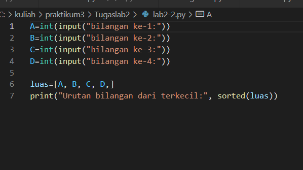
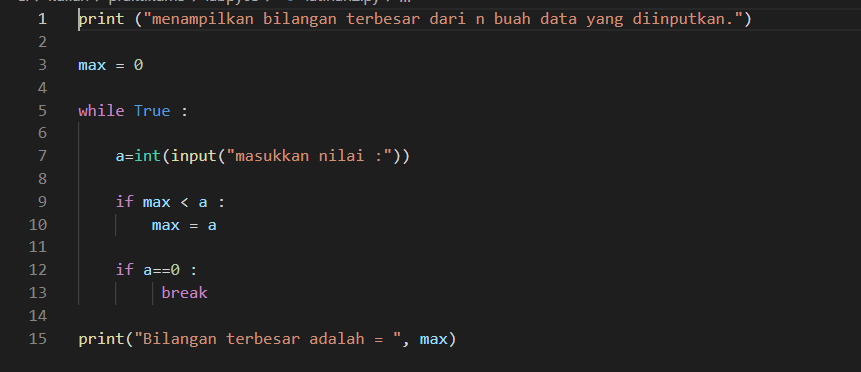
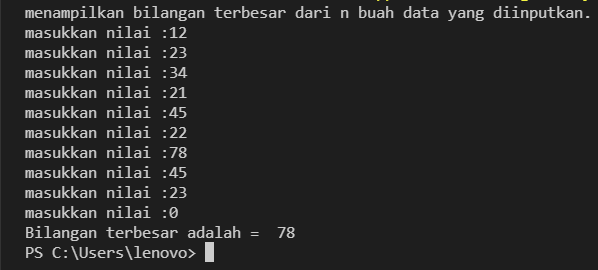
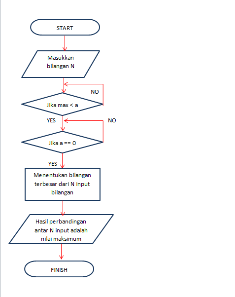
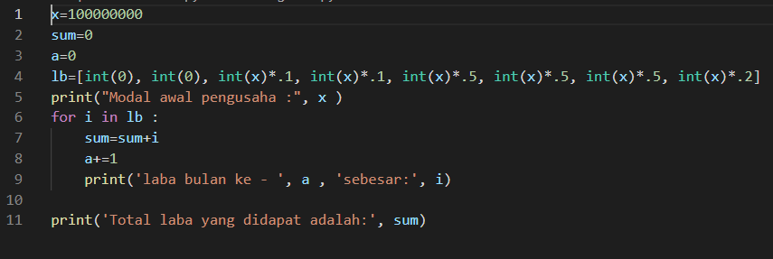
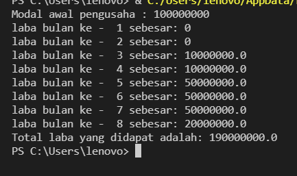
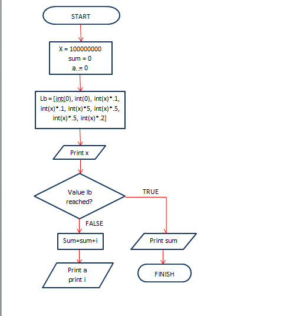

# TUGAS LAB 2 
## LAB 2 - 1 
### Program sederhada dengan input 2 buah bilangan, kemudian tentukan bilangan terbesar dari kedua bilangan.

berikut ini adalah tampilan programnya 

berikut adalah saat program runnning 

berikut adalah flowchart dari program tersebut

pseudocode:

- A dan B sebagai variabel int dari inputan

- masukkan nilai dari A dan B 

- program akan membaca apakah A > B dan B > A 

- sistem akan menampilkan nilai terbesar dari antara variabel A atau B jika A > B atau B > A
 

penjelasan:

- variabel pendeklerasiaan untuk sistem penginputan saat running 

A=int(input("Masukkan nilai A : "))

B=int(input("Masukkan nilai B : "))

- untuk mencari bilangan terbesar dari 2 bilangan algoritmanya yang dimasukkan akan membandingkan terlebih dahulu apakah A > B dan B < A

- jika A > B maka sistem akan menampilkan nilai dari A 

- tetapi jika nilai B > A maka sistem akan menampilkan nilai dari B 

## LAB 2 - 2
### program untuk mengurutkan data berdasarkan input sejumlah data (minimal 3 variable input atau lebih),kemudian tampilkan hasilnya secara berurutan mulai dari data terkecil.

berikut ini adalah tampilan dari programnya 

berikut ini adalah tampilan dari programnya

penjelasan :

- A,B,C,D sebagai variabel dari sebuah inputan 
- untuk memasukkan nilai dari sebuah inputan kita menggunakan int dan input contoh :

A=int(input("bilangan ke-1:"))

B=int(input("bilangan ke-2:"))

C=int(input("bilangan ke-3:"))

D=int(input("bilangan ke-4:"))

- masukkan nilai dari A,B,C,D 

- luas = [ A, B, C, D,] adalah sebuah perintah bahwa pemisah dari hasil inputan adalah koma  
- untuk membuat agar hasil dari inputan berurutan mulai dari data terkecil menggunakan sorted

# TUGAS LAB 3
## Lab 3 - 1
### Buat program dengan perulangan bertingkat (nested) for.
berikut ini adalah programnya 

berikut adalah saat program running

penjelasan:

- Variabel Pendeklarasian

baris = 10

kolom = baris 

- untuk perulangan baris dan kolom menggunakan nested for 

for bar in range(baris):

    for col in range(kolom):

        tab = bar+col

- untuk menampilkan hasil dari perulangan 

1.agar terlihat rapi menggunakan format string rata ke kanan sebanyak 6 karakter

2.agar tidak membuat baris baru mengunakan end=''(baris)

3.penggunaan print () untuk membuat baris baru kolom 

print("{0:>6}".format(tab), end='')

    print()

## Lab 3 - 2
### Tampilkan n bilangan acak yang lebih kecil dari 0.5.
### nilai n diisi pada saat runtime
### anda bisa menggunakan kombinasi while dan for untuk menyelesaikannya

berikut ini adalah programnya

berikut ini adalah program saat running

berikut ini flowchart dari program tersebut

pseudocode

- import random memanggil file random.

- n = int(input("Masukan nilai N : ")) input variabel n, tipe data integer.

- for c in range(n) : looping for index c dengan jumlah perulangan sebanyak n.

- b = random.uniform(.0,.5) variabel a berisikan angka acak dari 0.0 sampai 0.5.

- print("Data ke : ",a,"==>",b) print data ke : a = index looping b = angka random.

penjelasan

- Ketikan Program import random

import random memanggil file secara acak.

- ketikan program n = int(input("Masukan nilai N : "))

n = int(input("Masukan nilai N : ")) input variabel n, tipe data integer.

- Program ketikan a=0

- ketikan program untuk c dalam range(n) :

for c in range(n) : looping for index c dengan jumlah perulangan sebanyak n.

- ketikan program a+=1

a+=1, setiap perulangan nilai akan bertambah 1

- ketikan program b = random.uniform(.0,.5)

b = random.uniform(.0,.5) variabel yang berisikan angka acak dari 0.0 sampai 0.5.

- ketikan program print("Data ke : ",a,"==>",b)

print("Data ke : ",a,"==>",b) print data ke : a = perulangan indeks b = angka acak sesuai 

# LABPY02
## LATIHAN 1 
### Membuat program menentukan nilai akhir

berikut ini adalah programnya 

berikut ini adalah program saat running

penjelasan :

- program ini adalah untuk menentukan nilai akhir dari mahasiswa dengan sistem perhitungan nilai akhir dengan sistem akhir=(int(tugas) * .2) + (int(uts) * .4) + (int(uas) * .4)

- dan akan menampilkan lulus atau tidak lulus dengan sistem,  keterangan = ("TIDAK LULUS", "LULUS")[akhir > 60.0] 

- sistem dari sebuah perhitungan ialah menggunakan nilai dari UTS,UAS dan TUGAS yang sudah diinputkan dan jika nilai tersebut diatas dari perhitungan  nilai akhir mahasiswa akan dinyatakan LULUS tetapi jika tidak maka mahasiswa dinyatakan TIDAK LULUS 

 
## LATIHAN 2
### Membuat program menampilkan status gaji karyawan.

berikut ini adalah programnya

berikut ini adalah program saat running 

penjelasan :

- masukkan nilai inputan dari gaji 

- masukkan inputan apakah sudah berkeluarga dengan mengisi (Y/T) proses ini menggunakan sistem . berkeluarga = (False, True)[input("Sudah berkeluarga? (Y/T)") == "Y"]

- masukkan inputtan apakah sudah memiliki rumah dengan mengisi (Y/T) proses ini menggunakan sistem .punya_rumah = (False, True)[input("Punya rumah? (Y/T)") == "Y"]

## LATIHAN 3
### penggunaan kondisi OR program membandingkan 3 input bilangan, apabila penjumlahan 2 bilangan hasilnya sama dengan bilangan lainnya, maka cetak pernyataan “BENAR”

berikut ini adalah programnya 

berikut ini adalah program saat running 

penjelasan 

- variabel deklarasi menggunakan A,B,C 
- untuk dapat memasukkan nilai dari inputan menggunakan int contoh
a = int(input("Masukkan bilangan A: "))

b = int(input("Masukkan bilangan B: "))

c = int(input("Masukkan bilangan C: "))

- program dari sistem penjumlahan yang digunakan yaitu if a+b == c or b+c == a or c+a == b:
- masukkan nilai inputan dari A dan B dan inputan C adalah hasil penjumlahan dari A dan B jika nilai inputan dari C tidak sesuai dengan penjumlahan A dan B maka sistem akan menampilkan tulisan SALAH tetapi jika nilai inputan C sesuai dengan hasil dari penjumlahan A dan B sistem akan menampilkan tulisan BENAR
 

## PROGRAM 2
### Buat repository dengan nama labspy02
### Buat program sederhana dengan input tiga buah bilangan, dari ketiga bilangan tersebut tampilkan bilangan terbesarnya. Gunakan statement if.
### Uraikan langkah atau algoritmanya pada file README.md, sertakan juga flowchart dan screenshot hasil eksekusi program. Tampilkan 3 kondisi inputan data.
### Commit dan push pada repository
### submit url repository pada classroom.

berikut ini adalah programnya 

berikut ini adalah program saat running 

berikut ini flowchart dari program tersebut

pseudocode:

- start

- gunakaan inisial a,b,c sebagai intenjer.

- baca A

- baca B

- baca C

- jika A > B dan A < C:

- cetak "bilangan terbesar dari 3 inputan ", A

- elif B > A dan B > C:

- cetak "bilangan terbesar dari 3 inputan",B

- else

- cetak "bilangan terbesar dari 3 inputan", C

- cetak " nilai terbesar yang diinputkan "

- berhenti

penjelasan:

- untuk mencari bilangan terbesar dari 3 bilangan algoritmanya yang dimasukkan akan membandingkan terlebih dahulu apakah A > B.

- jika A > B,maka ada 2 kadidat bilangan terbesar,yaitu A dan C sehingga perlu dilakukan pengujian yang lebih besar dari A dan C dengan membandingkan nilai B dan C. jika nilai B ternyata lebih besar dari C, maka bilangan terbesar adalah A.nilai terbesar adalah C jika ternyata C lebih besar dari A.

- .jika kondisi A > B tidak terpenuhui(atau B <=A),maka 2 kadidat bilangan terbesar adalah B dan C.jika nilai C ternyata lebih kecil dari A,maka B adalah nilai terbesar,sedangkan jika C yang lebih besar dari B ,maka yang terbesar adalah C.

# LABPY03
## LATIHAN 1 
### Tampilkan n bilangan acak yang lebih kecil dari 0.5.
### nilai n diisi pada saat runtime
### anda bisa menggunakan kombinasi while dan for untuk menyelesaikannya
### gunakan fungsi random() yang dapat diimport terlebih dahulu

berikut ini adalah programnya 

berikut ini adalah program saat running

berikut ini adalah flowchart dari program tersebut

peseudocode 

- import random memanggil file random.

- n = int(input("Masukan nilai N : ")) input variabel n, tipe data integer.

- for c in range(n) : looping for index c dengan jumlah perulangan sebanyak n.

- b = random.uniform(.0,.5) variabel a berisikan angka acak dari 0.0 sampai 0.5.

- print("Data ke : ",a,"==>",b) print data ke : a = index looping b = angka random .

penjelasan

- Ketikan Program import random

import random memanggil file secara acak.

- ketikan program n = int(input("Masukan nilai N : "))

n = int(input("Masukan nilai N : ")) input variabel n, tipe data integer.

- Program ketikan a=0

- ketikan program untuk c dalam range(n) :

for c in range(n) : looping for index c dengan jumlah perulangan sebanyak n.

- ketikan program a+=1

a+=1, setiap perulangan nilai akan bertambah 1

- ketikan program b = random.uniform(.0,.5)

b = random.uniform(.0,.5) variabel yang berisikan angka acak dari 0.0 sampai 0.5.

- ketikan program print("Data ke : ",a,"==>",b)

print("Data ke : ",a,"==>",b) print data ke : a = perulangan indeks b = angka acak sesuai >

## LATIHAN 2
### Buat program untuk menampilkan bilangan terbesar dari n buah data yang diinputkan. Masukkan angka 0 untuk berhenti.

berikut ini adalah programnya 

berikut ini adalah program saat running

berikut ini flowchart dari program

pseudocode

- maks=0 variabel maks diisi 0.

- while True : perulangan while dengan syarat True.

- if max < a: max = suatu proses jika untuk mencari nilai terbesar.

- a = int(input('Masukan bilangan = ')) input nilai a dengan tipe data integer.

- if a==0 : break jika inputan diisi angka 0 maka break alias berhenti looping.

- print('Bilangan terbesarnya adalah = ',max) print nilai terbesar, variabel max

penjelasan

- Ketikan Program maks= 0

max= 0 kode max disini untuk menentukan nilai max nya dalah 0

- Ketikan Program saat benar :

while true: Untuk perulangan hingga waktu yang tidak ditentukan atau selamanya

- Ketikan Program a=int(input("Masukan Bilangan :"))

a=int(input("Masukan Bilangan :")) a untuk menginput tipe data interger ( bilangan bulat )

Program ketikan jika max < a

- Ketikan Program max=a

if max < a max=a jika max kurang dari a maka max = a

- Program ketikan jika a==0 :

- Ketikan Program istirahat

if a==0: break jika a= 0 maka akan berhenti dengan syarat break yang terpenuhi

- Ketikan Program print("Bilangan Tebesarnya Adalah :", max)

print("Bilangan Tebesarnya Adalah :", max)*Bilangan Tebesar Adalah : Nilai maxiumnya

## PROGRAM 1
### Buat repository baru labpy03
### Masukkan latihan1.py dan latihan2.py ke dalam repository.
### Buat program sederhana dengan perulangan: program1.py Seorang pengusaha menginvestasikan uangnya untuk memulai usahanya dengan modal awal 100 juta, pada bulan pertama dan kedua belum mendapatkan laba. pada bulan ketiga baru mulai mendapatkan laba sebesar 1% dan pada bulan ke 5, pendapatan meningkat 5%, selanjutnya pada bulan ke 8 mengalami penurunan keuntungan sebesar 2%, sehingga laba menjadi 3%. Hitung total keuntungan selama 8 bulan berjalan usahanya.
### buat file README.md, yang berisi penjelasan alur algoritma program latihan1.py, latihan2.py, dan program1.py beserta screenshot hasilnya.
### kemudian commit dan push ke repository (github)
### kirim url repository ke classroom.

berikut ini adalah programnya 

berikut ini adalah program saat running

berikut ini flowchart dari program

pseudocode

- x=100000000 modal 100.000.000, variabel x.

- sum=0 variabel untuk menjumlah total laba.

- y=0 variabel untuk masa bulan.

- lb = [int(0), int(0), int(a) * .1, int(a) * .1, int(a) * .5, int(a) * .5, int(a) * .5, int(a) * .2] variabel untuk jumlah laba perbulan, dipisahkan dengan koma dan tipe data integer.

- for i in lb : looping for index i dengan mengambil data dari lb.

- sum=sum+i rumus untuk menghitung total laba perbulan.

- y+=1 masa bulan, tiap looping menambah 1.

- print('Laba Bulan Ke-', y ,'Sebesar :',y) print : y = ambil masa bulan, i = ambil dari data yang ada di dalam lb.

- print('TOTAL LABA YANG DI DAPAT ADALAH :',sum) print total laba.

penjelasan

- program ketikan

 x=100000000 modal 100.000.000, variabel x.

- Ketikan jumlah program=0

sum=0 kode sum disini untuk menentukan jumlah total laba

- program kapan

y=0 y= untuk variabel masa bulan

- ketikan program lb = [int(0), int(0), int(x) * .1, int(x) * .1, int(x) * .5, int(x) * .5, int(x )* .5, int(x) * .2]

lb = [int(0), int(0), int(x) * .1, int(x) * .1, int(x) * .5, int(x) * .5, int(x )* .5, int(x) * .2] Untuk Mendeklarasikan presentase laba tiap bulan dan di kali dengan x atau data inputan modal investasi yaitu 100000000

- ketikan program print("Modal Awal Seorang Pengusaha :',x")

print(" Modal Awal Seorang Pengusaha :',x") menyaksikan kalimat *Modal Awal : dan data yang berisi di x yaitu 100000000

- ketikan program untuk i in lb :

for i in lb : looping for index i dengan mengambil data dari lb.

- ketikan program sum=sum+i

sum=sum+i rumus untuk menghitung total laba perbulan.

- kapann program y+1

 y+=1, masa bulan tiap perulangan menambah 1.

- print('Laba Bulan Ke-', y ,'Sebesar :',i)

print('Laba Bulan Ke-', y ,'Sebesar :',i) print : y = ambil masa bulan, i = ambil dari data yang ada di dalam lb.

- print('JUMLAH LABA YANG DI DAPAT ADALAH :',jumlah)

 print('TOTAL LABA YANG DI DAPAT ADALAH :',jumlah) print total laba.

